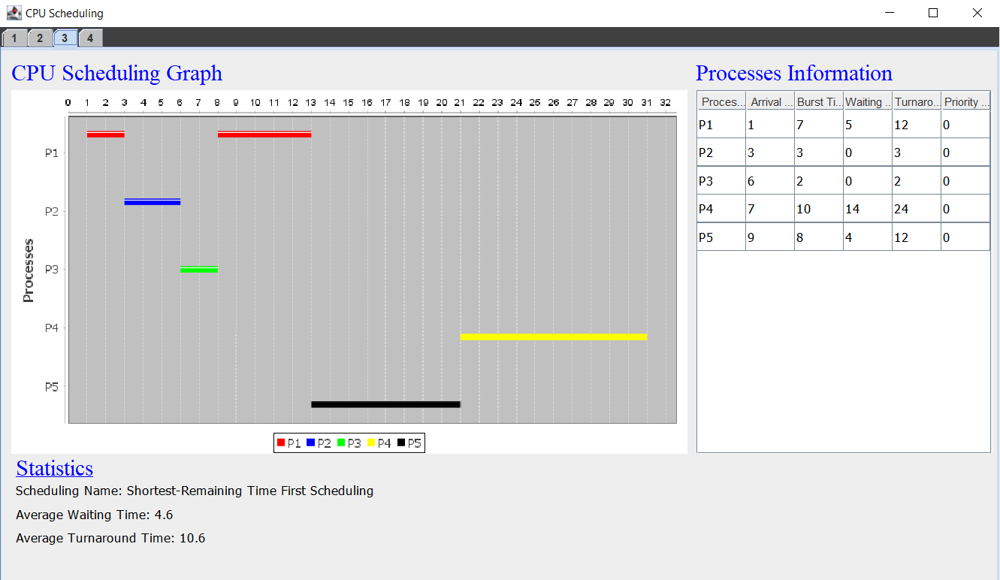
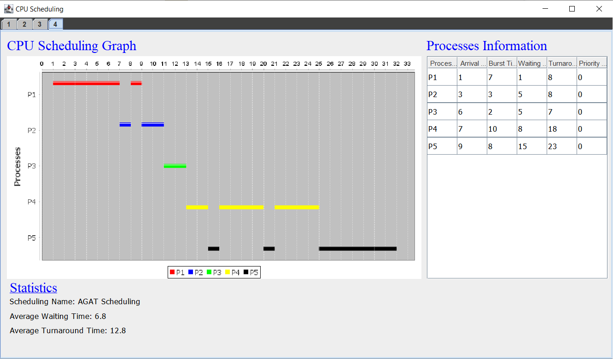

# CPU Scheduling Algorithms
Implementation of Scheduling Algorithms as taught in the Operating Systems Course

## Includes
- Non-Preemptive Priority Scheduling with Context Switching  
- Non-Preemptive Shortest- Job First (SJF)
- Shortest-Remaining Time First (SRTF) Scheduling with Context Switching
- AGAT Scheduling

##Screenshots

